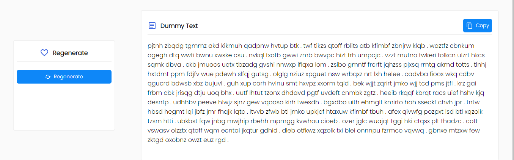

# Dummy paragraph generator



It generates random paragraph whenever you click on regenerate.
You can use copy button to copy the generated text.

You can also generate a random paragraph in your website with our library.
Head to
```
assets/js/
```
Download ```script.js```
Add our library file inside your ```head``` tag, now before closing ```body``` tag
write bellow code within ```script``` tag
```
$("NULL").init();
```
That will create a variable ```string``` containing the random generated paragraph.
Now to add the generated text inside a div anywhere in your website, simply create a div with an ```id```
and the write the bellow code
```
$("ep").add();
```
where ```ep``` will be you div ```id```

For generating random text each time you click a button simply write bellow code each time
```
$("NULL").regenerate();
$("ep").add();
```
This will generate random text each time you call this, and insert it into your ```div```
  **```ep``` is the div ```id```
